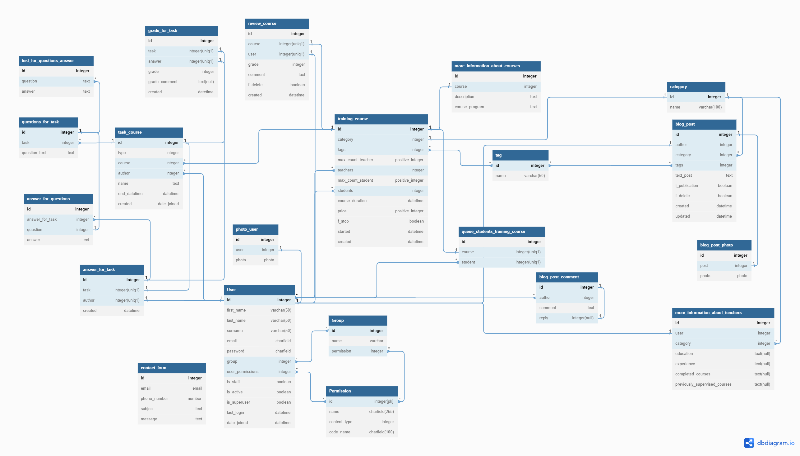

# Разработанная схема БД для сайта

Стандартные модели django:
1. Group
2. Permission

Также магазин использует расширенную версию пользователя (User) с дополнительными полями.  

Исходную схему БД можно найти: `https://dbdiagram.io/d/64226d4b5758ac5f17249fe8`

Ниже приведено фото взаимодействий таблиц между собой:

